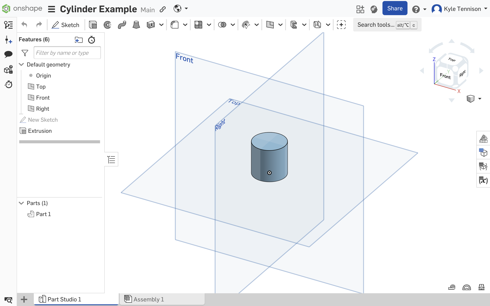

# OnPy

An interface for creating [OnShape](https://onshape.com) models entirely
through Python.

[](https://github.com/kyle-tennison/onpy/actions/workflows/validate.yml)
[](https://opensource.org/license/mit)
[](https://pypi.org/project/onpy/)

## Overview

Pyshape is a python-based, high level interface to building 3D models in [Onshape](https://onshape.com)—a cloud based CAD system.

In Pyshape you can:

- Build 2D sketches
- Extrude to create 3D geometries
- Interface with other OnShape features

## Installation & Authentication

You can install OnPy with pip:

```
pip install onpy
```

The first time you run OnPy, you will need to load your [OnShape developer keys](https://dev-portal.onshape.com/keys). OnPy will automatically prompt you the first time it runs. You can trigger this dialogue with:

```
$ python -c "from onpy import Client;Client()"
```

Then, you can provide your keys:

```
$ python -c "from onpy import Client;Client()"

OnPy needs your OnShape credentials.
navagate to https://dev-portal.onshape.com/keys and generate a pair of access & secret keys. Paste them here when prompted:

secret key: ...
access key: ...
```

Alternatively, you can set your OnShape keys as environment variables

- `ONSHAPE_DEV_SECRET` - The developer secret key
- `ONSHAPE_DEV_ACCESS` - The developer "access" key

## Usage

[In depth guide coming soon]

### What is OnPy for?

OnPy's primary purpose is to mock the workflow of a typical parametric cad program through Python. This allows tools like LLMs and automation products
to interface with OnShape.

OnShape natively supports [FeatureScript](https://cad.onshape.com/FsDoc/); an OnShape native scripting language used for defining OnShape features. FeatureScript is a vastly powerful tool—many of it's strengths are leveraged in this package. However, FeatureScript is created to define individual features; there is no way to parametrically generate a design with it.

Instead, OnPy interfaces with OnShape's APIs to create designs that function the same as ones generated in the web ui.

### Syntax

The following is from [`examples/cylinder.py`](examples/cylinder.py) :

```python
from onpy import Client
from onpy.features import Sketch, Extrude

client = Client() # we use the client object as the entry-point to OnShape

# we'll create a new document, then reference the default partstudio
document = client.create_document("Cylinder Example")
partstudio = document.get_partstudio()

# now, we'll define a sketch
sketch = Sketch(
    partstudio=partstudio, # we pass a reference to the partstudio
    plane=partstudio.features.top_plane, # we define the plane to draw on
    name="New Sketch" # and we name the sketch
)

# in this new sketch, we'll draw a circle
sketch.add_circle(center=(0,0), radius=0.5) # the default units are inches

# that's all we'll add to this sketch. we can add this to the partstudio with:
partstudio.add_feature(sketch)

# next, we'll extrude the sketch. the syntax is similar
extrude = Extrude(
    partstudio=partstudio, # another partstudio reference
    targets=[sketch], # we'll extrude the entire sketch ...
    distance=1 # ... by one inch
)
partstudio.add_feature(extrude)
```

If we look in our browser, we'll see a new document aptly named "Cylinder Example."



## Contributing

OnPy is obviously in it's earliest stage. All contributors are gratefully welcomed.

This module is structured to be as idiomatic as possible, while also following some of OnShape's layout quirks. There is no strict rules for this repository, but it's a good idea to try to stick with the flow of other things.
